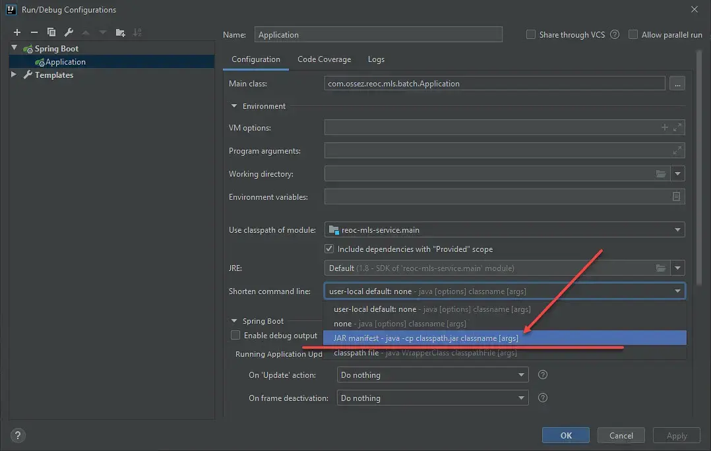

#### 1、运行项目时，参数过多，或者路径过长达到Windows操作系统对命令行长度的限制就会报错-->Error running XxxApplication: Command line is too long. Shorten command line for Xxx

~~~
命令行长度限制的解释：

当在IDEA中运行一个Java项目或应用程序时，IDEA会生成一个命令行来执行相应的操作。这个命令行包含了一系列参数、选项和路径信息。而每个字符或字节都会占据命令行的一部分。

举个例子，假设项目路径非常长，例如：C:\Users\Username\Documents\Projects\MyProject\src\main\java\com\example\myproject。那么在生成命令行时，就会包含这个长路径，例如：

java -cp C:\Users\Username\Documents\Projects\MyProject\src\main\java\com\example\myproject\libs\library.jar com.example.myproject.Main

在这个例子中，命令行中的路径就占据了很多字符或字节。

Windows对于命令行长度有一个限制，具体取决于操作系统的版本和配置。例如，Windows XP有一个限制为8191个字符，Windows 10有一个限制为32767个字符。当命令行长度超过这个限制时，就会出现"Command line is too long"的错误。

因此，为了解决这个问题，可以缩短命令行的长度。比如，将项目移动到较短的路径下（例如C:\Projects\MyProject），或者删除一些不必要的依赖项，减少命令行中的参数数量等等。这样可以确保命令行不会超过Windows操作系统对命令行长度的限制。

~~~

~~~
与此同时Idea也提供了解决方案：
修改项目下 .idea/workspace.xml，找到标签 <component name="PropertiesComponent"> ， 在标签里 加一行
<property name="dynamic.classpath" value="true" />

如果还是不行，修改如下：
~~~

